<div align="center">


<br/>

<p align="center">
  <a href="https://github.com/Mohamed101010101/nma-nsclc-evidence-synthesis">
    
  </a>
  <a href="https://github.com/Mohamed101010101">
    
  </a>
  <a href="https://github.com/Mohamed101010101">
    
  </a>
</p>

</div>

---

## 🔬 Scientific Philosophy & Mission

> *"In modern oncology, clinical practice guidelines frequently face an intractable dilemma: multiple active first-line systemic therapies exist, yet direct head-to-head randomized trials comparing all regimens are rarely available. Network Meta-Analysis (NMA) bridges this fundamental divide—synthesizing direct and indirect trial evidence through graph theory and likelihood models into a unified, mathematically coherent global evidence hierarchy."*

I design and engineer **reproducible, high-throughput computational evidence synthesis systems in R**, combining:
- **Graph-Theoretical Network Synthesis:** Multi-arm correlation-preserving NMA using the electrical network / random walk framework (`netmeta`).
- **Inconsistency Auditing & Diagnostics:** Node-splitting, design-by-treatment interaction decomposition, and NetHeat spectral matrix diagnostics.
- **Decision Analytics & Clinical Valuation:** Translating statistical hazard ratios into ASCO/ESMO Minimal Clinically Important Differences (MCID) and bivariate benefit-risk trade-offs.

---

## 🗺️ End-to-End Evidence Synthesis Pipeline Architecture

```mermaid
flowchart LR
    subgraph Data["1. Evidence Ingestion"]
        A["24 Landmark Phase II/III RCTs<br/><b>15,753 Patients</b>"] --> B["Multi-Arm Correlation Adjustment<br/><b>Covariance Preserving</b>"]
    end

    subgraph Analytics["2. Mathematical Synthesis (12 Engines)"]
        B --> C["netmeta Global Network<br/><b>Frequentist Graph Model</b>"]
        C --> D["Inconsistency Diagnostics<br/><b>Node-Splitting & NetHeat</b>"]
        C --> E["Component Decomposition<br/><b>Synergy & Additivity</b>"]
    end

    subgraph Translation["3. Clinical Decision Analytics"]
        D --> F["Hierarchy Profiling<br/><b>P-Scores & 10k Simulations</b>"]
        E --> F
        F --> G["ASCO / ESMO MCID<br/><b>Benefit-Risk Optimization</b>"]
    end

    subgraph Output["4. Publication Artifacts"]
        G --> H["14 Exhibits (300 DPI Vector)<br/><b>Lancet / NEJM Standards</b>"]
    end

    style A fill:#0D1117,stroke:#30363D,color:#C9D1D9
    style B fill:#0D1117,stroke:#30363D,color:#C9D1D9
    style C fill:#0D2744,stroke:#2997FF,color:#FFFFFF,stroke-width:2px
    style D fill:#0D1117,stroke:#30363D,color:#C9D1D9
    style E fill:#0D1117,stroke:#30363D,color:#C9D1D9
    style F fill:#0D1117,stroke:#30363D,color:#C9D1D9
    style G fill:#0D2744,stroke:#2997FF,color:#FFFFFF,stroke-width:2px
    style H fill:#1C3D24,stroke:#3FB950,color:#FFFFFF,stroke-width:2px
```



---

## 🏆 Flagship Landmark Repository

### 🩺 [`nma-nsclc-evidence-synthesis`](https://github.com/Mohamed101010101/nma-nsclc-evidence-synthesis)
> **Publication-Grade Frequentist Network Meta-Analysis Engine for Advanced Oncology**

An enterprise-grade, fully reproducible research engine evaluating first-line systemic immunotherapies and chemotherapies in advanced non-small cell lung cancer (NSCLC):

- 📊 **Curated Clinical Base:** 24 landmark randomized controlled trials comprising **15,753 patients**.
- ⚙️ **Modular Execution:** 12 sequential mathematical engines (`01_fit_nma_model.R` through `12_mcid_analysis.R`).
- 🔬 **Sensitivity & Rigor:** Full leave-one-out cross-validation, design-by-treatment tests, and 10,000-scenario Monte Carlo simulations.
- 🎨 **Visual Portfolio:** 14 high-resolution, 300-DPI vector exhibits adhering strictly to *Lancet*, *NEJM*, and *JAMA Oncology* guidelines.
- 📜 **Reproducibility Guarantee:** Curated data tables, exact session lockfile parameters, and complete open-source code under the MIT License.

```
📁 nma-nsclc-evidence-synthesis/
├── 📂 data/                 # Systematic extraction matrices (OS, PFS, Grade 3-5 Toxicities)
├── 📂 scripts/analyses/     # 12 sequential mathematical engines (Modular R pipeline)
├── 📂 outputs/figures/      # 14 publication-grade 300 DPI exhibits (Vector PDF & PNG)
├── 📂 report/               # Publication-grade R Markdown analytical monograph
├── 📄 REPRODUCIBILITY.md   # Complete computational environment audit & execution log
└── 📄 LICENSE              # Open-source MIT License
```

---

## 📐 Methodological Matrix & Core Competencies

<table>
  <tr>
    <td width="33%" valign="top">
      <h4>🧬 Evidence Synthesis</h4>
      <ul>
        <li>Network Meta-Analysis (NMA)</li>
        <li>Pairwise Meta-Analysis (DL, REML)</li>
        <li>Component Network Meta-Analysis</li>
        <li>Local &amp; Global Inconsistency Audits</li>
        <li>Node-Splitting &amp; Back-Calculation</li>
        <li>Design-by-Treatment Interaction</li>
      </ul>
    </td>
    <td width="33%" valign="top">
      <h4>📊 Decision Analytics</h4>
      <ul>
        <li>Treatment Ranking (P-Scores, SUCRA)</li>
        <li>Probabilistic Monte Carlo Simulations</li>
        <li>ASCO / ESMO MCID Benefit Benchmarks</li>
        <li>Bivariate Benefit-Risk Trade-Off Models</li>
        <li>Leave-One-Out Robustness Audits</li>
        <li>Meta-Regression &amp; Subgroup Analysis</li>
      </ul>
    </td>
    <td width="33%" valign="top">
      <h4>💻 Computational Engineering</h4>
      <ul>
        <li><strong>Core Ecosystem:</strong> <code>R</code> (<code>netmeta</code>, <code>meta</code>, <code>tidyverse</code>)</li>
        <li><strong>Reproducibility:</strong> Quarto, R Markdown, <code>renv</code></li>
        <li><strong>Publication Engine:</strong> 300 DPI <code>ggplot2</code>, Grid</li>
        <li><strong>Version Control:</strong> Git, GitHub Workflows</li>
        <li><strong>Cross-Disciplinary:</strong> Python, LaTeX, BibTeX</li>
      </ul>
    </td>
  </tr>
</table>

---

## 🎯 Global Methodological Compliance

<div align="center">

| International Framework | Computational Implementation Scope |
| :--- | :--- |
| **PRISMA-NMA (2015)** | Complete 32-item checklist alignment across network geometry, bias, and reporting |
| **Cochrane Handbook v6** | Multi-arm trial correlation adjustment and variance-covariance preservation |
| **GRADE Working Group** | Systematic assessment of transitivity, direct/indirect coherence, and certainty |
| **ASCO / ESMO Frameworks** | Quantitative evaluation of Minimal Clinically Important Difference (MCID) thresholds |

</div>

---

## 📊 Analytics & Activity

<div align="center">


</div>

---

<div align="center">

### 📬 Connect & Collaborate
*Driven by mathematical precision, reproducible science, and high-impact clinical oncology.*

[](https://github.com/Mohamed101010101)
[](https://github.com/Mohamed101010101/nma-nsclc-evidence-synthesis)

<sub>Crafted with Cupertino minimalism · Powered by R and Open Science</sub>

</div>
